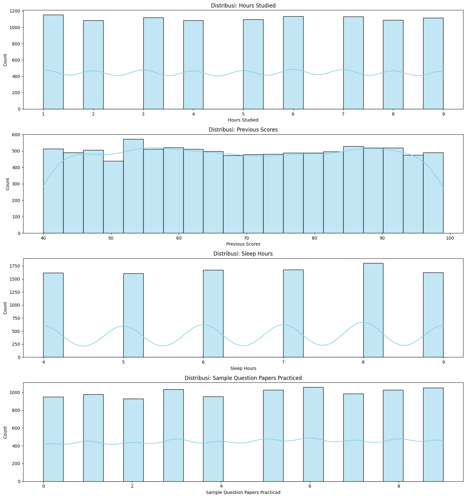

# Laporan Proyek Machine Learning - Akmal Shahib Maulana

## Domain Proyek

Pendidikan telah menjadi tonggak keberlangsungan sebuah bangsa. Pendidikan yang baik dan tepat sasaran tidak hanya membuka potensi yang dimiliki oleh setiap individu, namun juga mendorong lahirnya inovasi-inovasi yang dapat menjawab tantangan zaman. Dengan sistem pendidikan yang berkualitas, sebuah negara dapat mengembangkan sumber daya manusia yang unggul, kreatif, dan inovatif, yang pada akhirnya menjadi motor penggerak pembangunan negara. Di sisi lain, Indonesia merupakan salah satu negara dengan jumlah penduduk terbesar di dunia, kaya akan keanekaragaman suku, budaya, dan sumber daya alam yang melimpah. Untuk dapat mengelola dan mengembangkan seluruh potensi tersebut secara optimal, dibutuhkan sumber daya manusia yang terdidik dan berkualitas. Hal ini sejalan dengan visi besar Indonesia dalam mewujudkan Generasi Emas 2045, yaitu menciptakan generasi unggul yang mampu bersaing secara global dan membawa Indonesia sejajar dengan negara-negara maju dalam bidang sumber daya manusia, guna menjadikan Indonesia sebagai negara adidaya di masa depan.

Sayangnya, kenyataan menunjukkan bahwa harapan akan Generasi Emas tersebut nampaknya harus menghadapi berbagai tantangan, salah satunya adalah kondisi pelajar di Indonesia yang masih belum sepenuhnya mencerminkan kualitas yang diharapkan. Tentu saja ada berbagai faktor yang menyebabkan kondisi memprihatinkan ini terjadi. Salah satunya berasal dari faktor internal pelajar itu sendiri [1]. Kemampuan akademik seorang pelajar sangat dipengaruhi oleh berbagai dorongan dan hambatan yang berasal dari dalam dirinya, seperti motivasi belajar, kedisiplinan, manajemen waktu, dan kondisi psikologis. Faktor-faktor tersebut dapat menentukan sejauh mana seorang pelajar mampu mencapai potensi terbaiknya dalam proses pembelajaran.

## Business Understanding

### Problem Statements

Dalam menganalisis faktor internal dari yang mempengaruhi performa dari siswa, pertanyaan utama yang menjadi fokus dalam penelitian ini:

- Faktor-faktor apa saja yang mempengaruhi performa siswa ?
- Seajuh mana model preditif dapat digunakan dalam memperkirakan performa siswa berdasarkan faktor internal mereka ?

### Goals

Menjelaskan tujuan dari pernyataan masalah:

- Mengidentifikasi dan menganalis faktor internal serta pengaruhnya pada indeks perfroma siswa. Tujuan ini akan menjadi insight bagi para tenaga pendidikan dan yang berwenang untuk dapat mengambil tindakan yang tepat terhadap faktor tersebut.
- Membangun model yang mampu memperkirakan indeks performa siswa dengan baik berdasarkan faktor-faktor internal mereka. Bertujuan untuk memudahkan pihak yang mungkin terkait untuk pencegahan dini terhadap penurunan performa.

### Solution statements

- Meneliti nilai kepentingan fitur dari model yang sudah di bangun untuk mengetahui seberapa berpengaruh masing-masing fiture tersebut.
- Menggunakan dua model machine learning untuk regressi yaitu random forest dan xgboost, dengan 3 metriks evaluasi yang sama yaitu MAE, MSE dan R2. Hal ini bertujuan untuk menghasilkan model predictive terbaik yang diukur dengan error terendah pada data testnya.

## Data Understanding

Data yang digunakan pada project ini adalah data terkait kebiasaan siswa yang bisa jadi berdampak pada kemampuan siswa, berasal dari kaggle dengan judul [Student Performance (Multiple Linear Regression)](https://www.kaggle.com/datasets/nikhil7280/student-performance-multiple-linear-regression) berisi 10.000 sampel dan Performance Index sebagai Target Datanya.

Selanjutnya uraikanlah seluruh variabel atau fitur pada data. Sebagai contoh:

### Variabel-variabel pada Student Performance (Multiple Linear Regression) adalah sebagai berikut:

- Hours Studied: Jumlah total jam yang dihabiskan untuk belajar oleh setiap siswa.
- Previous Scores: Nilai yang diperoleh siswa dalam tes sebelumnya.
- Extracurricular Activities: Apakah siswa berpartisipasi dalam kegiatan ekstrakurikuler (Ya atau Tidak).
- Sleep Hours: Jumlah rata-rata jam tidur siswa per hari.
- Sample Question Papers Practiced: Jumlah contoh soal yang telah dikerjakan oleh siswa.
- Performance Index: Ukuran kinerja keseluruhan dari setiap siswa. Indeks prestasi mewakili prestasi akademik siswa dan telah dibulatkan ke bilangan bulat terdekat. Indeks ini berkisar antara 10 hingga 100, dengan nilai yang lebih tinggi menunjukkan kinerja yang lebih baik.

Dari total 10000 instance data, tidak terdapat missing value maupun outlier, namun terdapat 127 data duplicate. Setiap variabel data memiliki distribusi yang cukup merata, tanpa menunjukkan adanya kesenjangan atau ketimpangan yang signifikan, sebagaimana ditunjukkan pada visualisasi di bawah ini.

| No  | Column                           | Jumlah | Dtype   |
| --- | -------------------------------- | ------ | ------- |
| 1   | Hours Studied                    | 10000  | int64   |
| 2   | Previous Scores                  | 10000  | int64   |
| 3   | Extracurricular Activities       | 10000  | object  |
| 4   | Sleep Hours                      | 10000  | int64   |
| 5   | Sample Question Papers Practiced | 10000  | int64   |
| 6   | Performance Index                | 10000  | float64 |

## Data Preparation

- Menghapus Duplicated value : sebegaimana yang telah disebutkan bahwa ada 127 data duplicate, penanganan yang dilakukan pada data duplikat tersebut adalah dihapus
- Standarisasi: digunakan untuk menyamakan skala antar fitur dan mempercepat konvergensi model. Tindakan ini dilakukan untuk meningkatkan akurasi model dan memastikan peforma model yang konsisten.
- Transformasi: Selanjutnya ada tranformasi data menggunakan label encoder untuk merubah data kategorikal yang diisi dengan nilai huruf contoh nya "yes" dan "no" menjadi angka yang setiap angka mewakilkan satu kategori. Proses ini harus diaplikasikan karena model machine learning hanya menerima input berupa angka.
- Data Splitting: Bertujuan untuk membagi data dengan rasio tertentu yang mana sebagian akan digunakan untuk melatih/membangun model machine learning sedangkan sebagian yang lain akan digunakan untuk menguji model yang sudah dibangun.

## Modeling

Algortima yang digunakan untuk proyek ini adalah Random forest dan XGBoost. Pemilihan Algoritma ini berdasarkan beberapa aspek berikut :

- Random Forest (RF)
  Cara Kerja: Metode ini diperkenalkan sebagai pendekatan lanjutan untuk pohon keputusan. Metode ini didasarkan pada konsep pembelajaran ensemble, yang mengasumsikan bahwa menggabungkan beberapa model akan menghasilkan akurasi yang lebih baik daripada hanya mengandalkan satu model [2].
  parameter: n_estimators, max_depth, min_samples_split, min_samples_leaf, max_features, bootstrap dan beberapa parameter lain seperti criterion, random_state, oob_score, dan n_jobs d
  (+) Robust terhadap overfitting karena RF terdiri dari banyak pohon keputusan dengan teknik bagging, menjadikannya cenderung lebih stabil.
  (-) Model besar dan lambat dibanding beberapa algoritma lain, karena terdiri dari banyak keputusan maka tentunya perlu komputasi yang lebih memakan waktu.

- XGBoost
  Cara Kerja: XGBoost adalah pengklasifikasi ensembel yang menggunakan konsep pohon keputusan untuk membagi data menjadi bagian-bagian yang lebih kecil dan membagi target [3].
  parameter: n_estimators, learning_rate, max_depth, subsample, colsample_bytree, gamma dan beberapa parameter lain seperti reg_alpha, reg_lambda, min_child_weight, booster, dan objective.
  (+) Kinerja prediktif sangat tinggi, dibuktikan dengan banyaknya artikel yang membahas keunggulan algortima ini
  (-) Tidak optimal pada data yang tidak terstuktur, hal ini sudah umum diketahui bahwa model gradient ini sensitif pada outlier

semua parameter dibiarkan dalam kondisi default dengan alasan penentuan parameter tanpa ada dasar bukan sesuatu tindakan yang bisa diterima dalam sebuah penelitian.

dari kedua model diatas Xgbost menjadi model terbaik berdasarkan performanya yang diukur pada 3 metriks yaitu Mean Square Error, Mean Absolute Error, dan R-Square. Dari ketiga metrik tersebut XGboost unggul pada MSE, MAE dan R2

## Evaluation

### 1. Mean Absolute Error (MAE)

$$
\text{MAE} = \frac{1}{n} \sum_{i=1}^{n} |y_i - \hat{y}_i|
$$

- Menghitung selisih antara nilai asli dengan nilai prediksi, kemudian diambil nilai absolute nya.
- Metrik ini digunakan jika kondisi data tidak memiliki outlier atau outlier bukan masalah besar pada dataset tersebut.

### 2. Mean Squared Error (MSE)

$$
\text{MSE} = \frac{1}{n} \sum_{i=1}^{n} (y_i - \hat{y}_i)^2
$$

- Menghitung selisih antara nilai asli dengan nilai prediksi, kemudian diambil nilai kuadrat nya.
- Cocok untuk digunakan untuk data dengan noise tinggi.

### 3. R-squared ($R^2$ Score)

$$
R^2 = 1 - \frac{\sum_{i=1}^{n} (y_i - \hat{y}_i)^2}{\sum_{i=1}^{n} (y_i - \bar{y})^2}
$$

- Mengukur seberapa besar variasi data aktual yang dapat dijelaskan oleh model.
- Dengan rentang nilai menunjukan seberapa baik model memberikan prediksi secara keseluruhan

berikut tabel untuk menunjukan hasil dari setiap metrik

| Model         | Train MSE    | Test MSE     | Train MAE    | Test MAE     | Train R²     | Test R²      |
| ------------- | ------------ | ------------ | ------------ | ------------ | ------------ | ------------ |
| Random Forest | **0.931158** | 5.673413     | **0.749827** | 1.905679     | **0.997470** | 0.984756     |
| XGBoost       | 2.511904     | **5.124343** | 1.241374     | **1.807403** | 0.993175     | **0.986231** |

dapat dilihat pada tabel tersebut Random Forest unggul pada data train nya namun pada data test XGBoost unggul. Berdasarkan hasil evaluasi ini, dapat dilihat bahwa meskipun XGBoost unggul dari kedua algoritma yang diuji, MAE dan MSE masih memiliki error yang tinggi, berarti model ini masih memiliki banyak selisih antara nilai prediksi nya dengan aslinya. (menjawab pertanyaan kedua)

### 4. Evaluasi lain

Selain menggunakan metrik evaluasi diatas untuk mengukur kinerja model sebagai model predictive, fungsi feature_importance dari model terbaik juga diambil untuk mengetahui seberapa penting masing masing variabel menurut model dalam mempengaruhi prediksi. Berikut tabel nilai kepentingan variabel

| No  | Feature                          | Importance |
| --- | -------------------------------- | ---------- |
| 1   | Previous Scores                  | 0.813823   |
| 0   | Hours Studied                    | 0.177658   |
| 3   | Sleep Hours                      | 0.003936   |
| 4   | Sample Question Papers Practiced | 0.002449   |
| 2   | Extracurricular Activities       | 0.002135   |

fungsi feature*importances* akan menampilkan nilai kepentingan masing-masing fitur pada dataset. disini kita lihat variabel yang paling berpengaruh ke indeks performa adalah Previous Scores, kedua Hours Studied, dan terakhir sleep hours. Variabel ini lah yang menjadi faktor-faktor yang mempengaruhi performa siswa (menjawab pertanyaan pertama)

Referensi

[1] C. F. Djarwo, “Analisis faktor internal dan eksternal terhadap motivasi belajar kimia siswa SMA Kota Jayapura,” Jurnal Ilmiah IKIP Mataram, vol. 7, no. 1, pp. 1–7, 2020.

[2] L. Taherkhani, A. Daneshvar, H. Amoozad Khalili, and M. R. Sanaei, “Analysis of the Customer Churn Prediction Project in the Hotel Industry Based on Text Mining and the Random Forest Algorithm,” Advances in Civil Engineering, vol. 2023, no. 1, p. 6029121, 2023.

[3] S. Ghosal and A. Jain, “Depression and suicide risk detection on social media using fasttext embedding and xgboost classifier,” Procedia Comput Sci, vol. 218, pp. 1631–1639, 2023.
